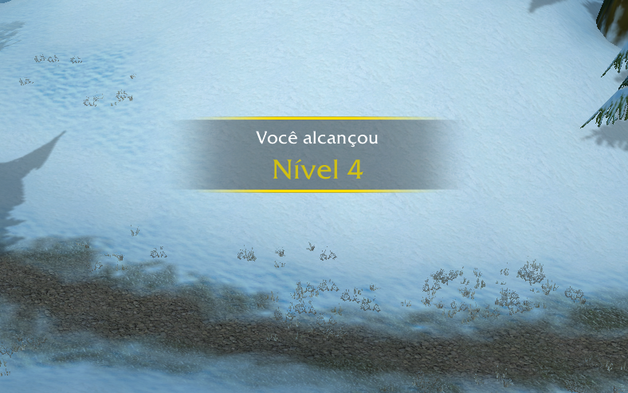

# NewLevelFrame

NewLevelFrame brings the modern WoW Retail level-up experience to WoW Classic, featuring a sleek and customizable frame that appears whenever you gain a level.

## Features

- Clean and modern design similar to WoW Retail's level-up frame
- Smooth fade in/out animations
- Fully customizable text sizes and timing settings
- Complete localization support for all WoW client languages

## Installation

1. Download the latest version from [Releases](https://github.com/paulovnas/NewLevelFrame)
2. Extract the ZIP file
3. Copy the "NewLevelFrame" folder to your WoW Classic AddOns directory:
   - Windows: `World of Warcraft\_classic_era_\Interface\AddOns`
   - Mac: `World of Warcraft/_classic_era_/Interface/AddOns`
4. Make sure the addon is enabled in the character selection screen
5. Enjoy your new level-up frame!

## Configuration

Access the configuration panel through:
1. Press ESC to open the Game Menu
2. Click "Interface"
3. Go to the "AddOns" tab
4. Find and click "NewLevelFrame"

### Available Settings

#### Font Sizes
- **Title Font Size (8-32)**: Customize the size of the "You have reached" text
- **Level Font Size (8-48)**: Adjust the size of the level number display

#### Timing Settings
- **Display Time (1-10 seconds)**: How long the frame stays fully visible
- **Fade In Time (0.1-5 seconds)**: Duration of the fade in animation
- **Fade Out Time (0.1-5 seconds)**: Duration of the fade out animation

## Commands

- `/lvltest`: Test the level-up frame with your current level

## Localization

NewLevelFrame automatically detects your WoW client language and displays all text in:
- English (enUS)
- Portuguese (ptBR)
- German (deDE)
- Spanish (esES/esMX)
- French (frFR)
- Korean (koKR)
- Simplified Chinese (zhCN)
- Traditional Chinese (zhTW)
- Russian (ruRU)

## Dependencies

- Ace3 (included)

## License

This project is licensed under the MIT License - see the [LICENSE](LICENSE) file for details.

## Author

- **Paulo Nascimento**

## Contributing

Feel free to submit issues and enhancement requests!

## Changelog

### Version 1.3
- Added configuration panel for font sizes and timing settings
- Improved localization support
- Added smooth fade animations
- Various bug fixes and improvements

---

## Português

NewLevelFrame traz a experiência moderna de subida de nível do WoW Retail para o WoW Classic, apresentando um frame elegante e personalizável que aparece sempre que você ganha um nível.

### Características

- Design limpo e moderno similar ao frame de level up do WoW Retail
- Animações suaves de fade in/out
- Tamanhos de texto e configurações de tempo totalmente personalizáveis
- Suporte completo de localização para todos os idiomas do cliente WoW

### Instalação

1. Baixe a última versão em [Releases](https://github.com/yourusername/NewLevelFrame/releases)
2. Extraia o arquivo ZIP
3. Copie a pasta "NewLevelFrame" para o diretório de AddOns do WoW Classic:
   - Windows: `World of Warcraft\_classic_era_\Interface\AddOns`
   - Mac: `World of Warcraft/_classic_era_/Interface/AddOns`
4. Certifique-se de que o addon está ativado na tela de seleção de personagem
5. Aproveite seu novo frame de level up!

### Configuração

Acesse o painel de configuração através de:
1. Pressione ESC para abrir o Menu do Jogo
2. Clique em "Interface"
3. Vá para a aba "AddOns"
4. Encontre e clique em "NewLevelFrame"

#### Opções Disponíveis

##### Tamanhos das Fontes
- **Tamanho da Fonte do Título (8-32)**: Personalize o tamanho do texto "Você alcançou"
- **Tamanho da Fonte do Nível (8-48)**: Ajuste o tamanho da exibição do número do nível

##### Configurações de Tempo
- **Tempo de Exibição (1-10 segundos)**: Quanto tempo o frame permanece totalmente visível
- **Tempo de Fade In (0.1-5 segundos)**: Duração da animação de aparecimento
- **Tempo de Fade Out (0.1-5 segundos)**: Duração da animação de desaparecimento

### Comandos

- `/lvltest`: Testa o frame de level up com seu nível atual
